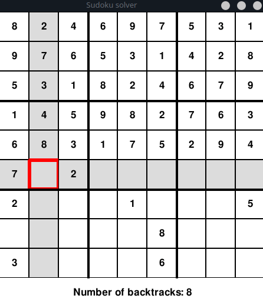

# Sudoku Backtracking Visualizer
Sudoku backtracking visualizer in Python using Pygame.

The `config.py` file can be changed to:
1) speed up or slow down program execution,
2) change the width & height of the window,
3) change visualizer settings and more.

Run using `python3 SudokuSolver.py`.

Then input a board, for example:
`8...9.5.19.6531.2.........91..98.7..6.3...29...2......2...1...5.....8...3....6...`

Requires pygame. Click [here](https://www.pygame.org/wiki/GettingStarted) for installation instructions.
